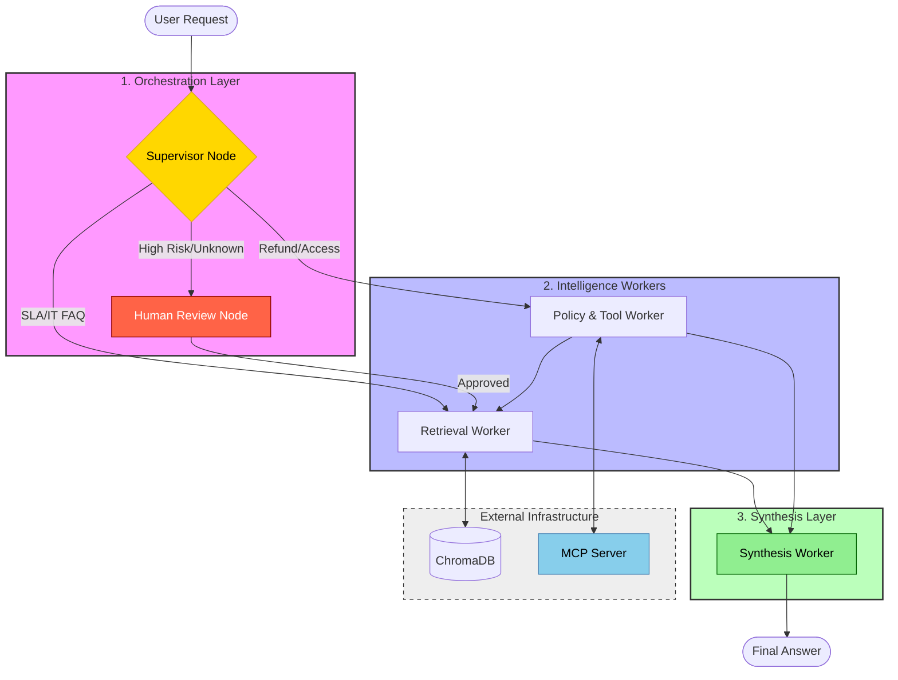

# System Architecture — Lab Day 09

**Nhóm:** C401 - C5  
**Ngày:** 14/04/2026  
**Version:** 1.0

---

## 1. Tổng quan kiến trúc

Hệ thống được thiết kế theo mô hình **Multi-Agent Orchestration**, chuyển đổi từ kiến trúc RAG nguyên khối (Day 08) sang một đồ thị xử lý linh hoạt hơn.

**Pattern đã chọn:** Supervisor-Worker  
**Lý do chọn pattern này (thay vì single agent):**
- **Separation of Concerns:** Mỗi Worker đảm nhận một nhiệm vụ chuyên biệt (truy xuất dữ liệu, kiểm tra chính sách, tổng hợp câu trả lời).
- **Khả năng kiểm soát (Control Flow):** Supervisor có thể quyết định luồng xử lý dựa trên độ phức tạp của câu hỏi, ví dụ: kích hoạt Human-in-the-loop cho các yêu cầu rủi ro cao hoặc gọi nhiều Workers cho câu hỏi multi-hop.
- **Tính mở rộng (Extensibility):** Dễ dàng tích hợp thêm các công cụ bên thứ ba thông qua giao thức MCP mà không cần thay đổi logic cốt lõi của Agent.

---

## 2. Sơ đồ Pipeline

Dưới đây là sơ đồ luồng dữ liệu của hệ thống:

---

## 3. Vai trò từng thành phần

### Supervisor (`graph.py`)

| Thuộc tính | Mô tả |
|-----------|-------|
| **Nhiệm vụ** | Phân tích ý định người dùng, phân loại Task và điều phối đến Worker phù hợp. |
| **Input** | `task` (câu hỏi thô từ người dùng). |
| **Output** | `supervisor_route`, `route_reason`, `risk_high`, `needs_tool`. |
| **Routing logic** | Sử dụng **Regex & Keyword matching** để phân loại nhanh (SLA keywords -> Retrieval; Refund/Access keywords -> Policy). |
| **HITL condition** | Kích hoạt khi gặp mã lỗi lạ (`err-xxx`) hoặc yêu cầu khẩn cấp liên quan đến thay đổi hệ thống. |

### Retrieval Worker (`workers/retrieval.py`)

| Thuộc tính | Mô tả |
|-----------|-------|
| **Nhiệm vụ** | Truy xuất các đoạn văn bản (chunks) có liên quan nhất từ cơ sở dữ liệu tri thức. |
| **Embedding model** | `all-MiniLM-L6-v2` (Sentence Transformers). |
| **Top-k** | 3 chunks mặc định. |
| **Stateless?** | Yes. |

### Policy Tool Worker (`workers/policy_tool.py`)

| Thuộc tính | Mô tả |
|-----------|-------|
| **Nhiệm vụ** | Kiểm tra các quy tắc nghiệp vụ (Refund policy, Access Control) và xử lý các ngoại lệ (Flash Sale, Digital goods). |
| **MCP tools gọi** | `search_kb`, `get_ticket_info`, `check_access_permission`. |
| **Exception cases xử lý** | Flash Sale (no refund), Digital products (no refund), Activated products. |

### Synthesis Worker (`workers/synthesis.py`)

| Thuộc tính | Mô tả |
|-----------|-------|
| **LLM model** | `gpt-4o-mini` (hoặc `gemini-1.5-flash`). |
| **Temperature** | 0.1 (để đảm bảo tính nhất quán và chặt chẽ). |
| **Grounding strategy** | **Strict Evidence-only**: Chỉ trả lời dựa trên context đã được Worker khác cung cấp. |
| **Abstain condition** | Khi không tìm thấy evidence trong context hoặc policy_result báo lỗi. |

### MCP Server (`mcp_server.py`)

| Tool | Input | Output |
|------|-------|--------|
| `search_kb` | query, top_k | chunks, sources |
| `get_ticket_info` | ticket_id | Jira ticket details (status, assignee, SLA) |
| `check_access_permission` | access_level, role | approvals required, emergency override |
| `create_ticket` | priority, title | ticket_id, URL |

---

## 4. Shared State Schema

Hệ thống sử dụng một biến `AgentState` duy nhất để truyền thông tin qua các Node.

| Field | Type | Mô tả | Ai đọc/ghi |
|-------|------|-------|-----------|
| `task` | str | Câu hỏi đầu vào | Supervisor đọc |
| `supervisor_route` | str | Đích đến của luồng xử lý tiếp theo | Supervisor ghi |
| `route_reason` | str | Giải thích lý do lựa chọn routing | Supervisor ghi |
| `retrieved_chunks` | list | Các đoạn context tìm được | Retrieval ghi, Synthesis đọc |
| `policy_result` | dict | Kết quả phân tích policy và ngoại lệ | Policy_tool ghi, Synthesis đọc |
| `mcp_tools_used` | list | Lịch sử các tool đã gọi | Policy_tool/Worker ghi |
| `final_answer` | str | Kết quả phản hồi cuối cùng | Synthesis ghi |
| `confidence` | float | Điểm tin cậy của câu trả lời (0.0 - 1.0) | Synthesis ghi |
| `history` | list | Log chi tiết các bước đã thực hiện | Toàn bộ đọc/ghi |

---

## 5. Lý do chọn Supervisor-Worker so với Single Agent (Day 08)

| Tiêu chí | Single Agent (Day 08) | Supervisor-Worker (Day 09) |
|----------|----------------------|--------------------------|
| **Debug khi sai** | Khó — phải đọc toàn bộ prompt dài và log LLM để tìm lỗi. | Dễ hơn — có trace cụ thể từng chặng, test được từng worker độc lập. |
| **Thêm capability mới** | Phải sửa toàn bộ prompt lớn, dễ gây side-effect ("quên" luật cũ). | Thêm worker hoặc MCP tool riêng biệt, không ảnh hưởng logic cũ. |
| **Routing visibility** | Hoàn toàn "hộp đen", không biết tại sao model lại chọn hướng đó. | Minh bạch qua trường `route_reason` và `workers_called`. |
| **Xử lý Multi-hop** | Dễ bị hallucinate khi phải tổng hợp nhiều luồng trong 1 lần gọi. | Xử lý tuần tự hoặc song song qua nhiều worker chuyên trách. |

**Nhóm điền thêm quan sát từ thực tế lab:**

Hệ thống Supervisor-Worker giúp giảm thiểu đáng kể tình trạng "quên" thông tin khi xử lý các task phức tạp, đồng thời cho phép kiểm soát chi phí token tốt hơn bằng cách chỉ gọi các model mạnh (như GPT-4o) ở bước Synthesis, trong khi các bước phân loại có thể dùng model nhỏ hơn.

---

## 6. Giới hạn và điểm cần cải tiến

1. **Độ trễ (Latency):** Việc chia nhỏ quy trình khiến tổng thời gian xử lý tăng lên (~1-2 giây) do phải thực hiện nhiều bước trung gian và gọi LLM tuần tự. Cần cải tiến bằng cách chạy song song (async) các worker không phụ thuộc nhau.
2. **Độ phức tạp của Supervisor:** Hiện tại Supervisor đang dùng Regex/Keyword matching đơn giản. Với tập câu hỏi lớn và nhiễu, cần chuyển sang dùng **Semantic Router** hoặc một model LLM nhỏ chuyên biệt để phân loại chính xác hơn.
3. **Mô phỏng MCP:** Các công cụ MCP hiện đang ở dạng Mock. Để hệ thống thực sự mạnh mẽ, cần deploy các MCP server thật kết nối với Database Jira, Search Engine và IAM system của doanh nghiệp.
4. **Khả năng tự hồi phục (Self-healing):** Hiện tại nếu một worker gặp lỗi, pipeline có thể bị dừng đột ngột. Cần bổ sung các cơ chế retry hoặc fallback node để đảm bảo hệ thống luôn trả về câu trả lời hữu ích cho người dùng.
